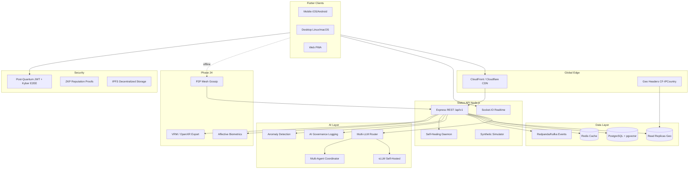
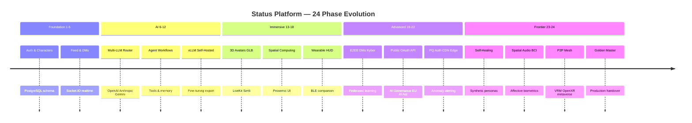
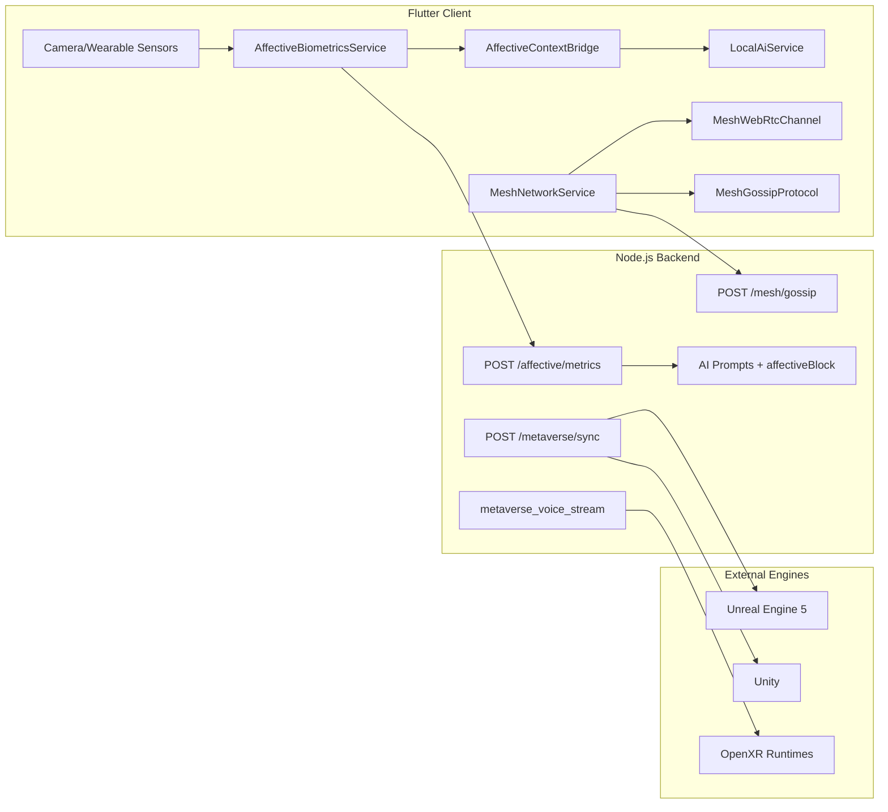
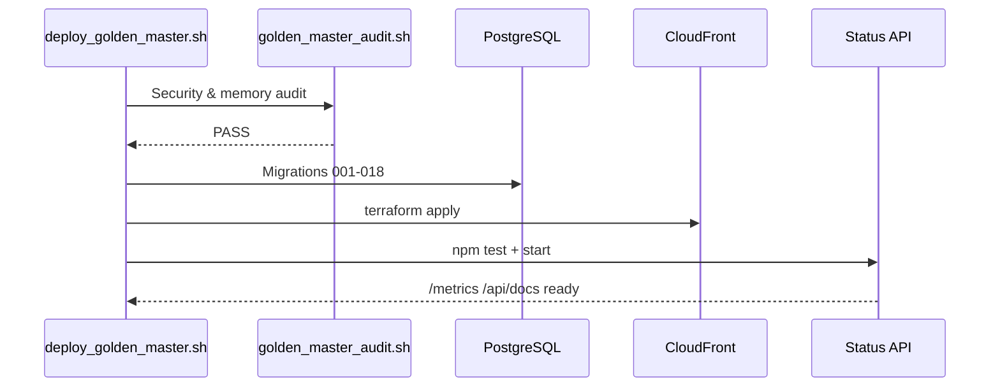

# Status Platform — Golden Master Architecture (Phases 1–24)

Production handover reference for the complete Status monorepo.

## Unified system topology



## Phase evolution map



## Phase 24 component diagram



## Deployment sequence



## Key endpoints (Phase 24)

| Endpoint | Method | Purpose |
|----------|--------|---------|
| `/api/v1/affective/metrics` | POST | Submit processed HRV/facial/voice stress |
| `/api/v1/affective/context` | GET | Latest affective AI context block |
| `/api/v1/mesh/register` | POST | Register P2P mesh peer |
| `/api/v1/mesh/gossip` | POST | Gossip sync threads/embeddings/memory |
| `/api/v1/mesh/signal` | POST | WebRTC signaling relay |
| `/api/v1/metaverse/sync` | POST | Create VRM/OpenXR sync session |
| `/api/v1/metaverse/export/:id` | GET | Export character manifest |
| `/api/v1/metaverse/sync/:token` | GET | Retrieve sync manifest |

## WebSocket events (metaverse)

| Event | Direction | Payload |
|-------|-----------|---------|
| `join_metaverse_sync` | Client → Server | syncToken |
| `metaverse_voice_chunk` | Client → Server | chunk, format |
| `metaverse_voice_stream` | Server → Clients | PCM/audio chunk |
| `metaverse_personality_sync` | Bidirectional | personality patch |

## Environment flags

```env
# Phase 24
AFFECTIVE_BIOMETRICS=true
MESH_NETWORK_ENABLED=true
MESH_CLUSTER_ID=status-local
```

## Audit & release

```bash
chmod +x deploy/deploy_golden_master.sh scripts/golden_master_audit.sh
./scripts/golden_master_audit.sh
DRY_RUN=true ./deploy/deploy_golden_master.sh
./deploy/deploy_golden_master.sh
```

## Migration index

| Migration | Phase | Description |
|-----------|-------|-------------|
| 005–010 | 1–12 | Core schema, auth, AI |
| 011 | 14 | Spatial computing |
| 013 | 19 | E2EE, fine-tuning |
| 014 | 20 | Wearable, IPFS, ZKP |
| 015 | 21 | Federated learning, public API |
| 016 | 22 | AI governance, PQ crypto |
| 017 | 23 | Self-healing, synthetic sim, BCI |
| 018 | 24 | Affective biometrics, mesh, metaverse |
